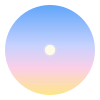
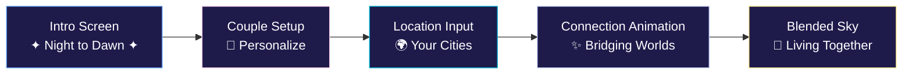
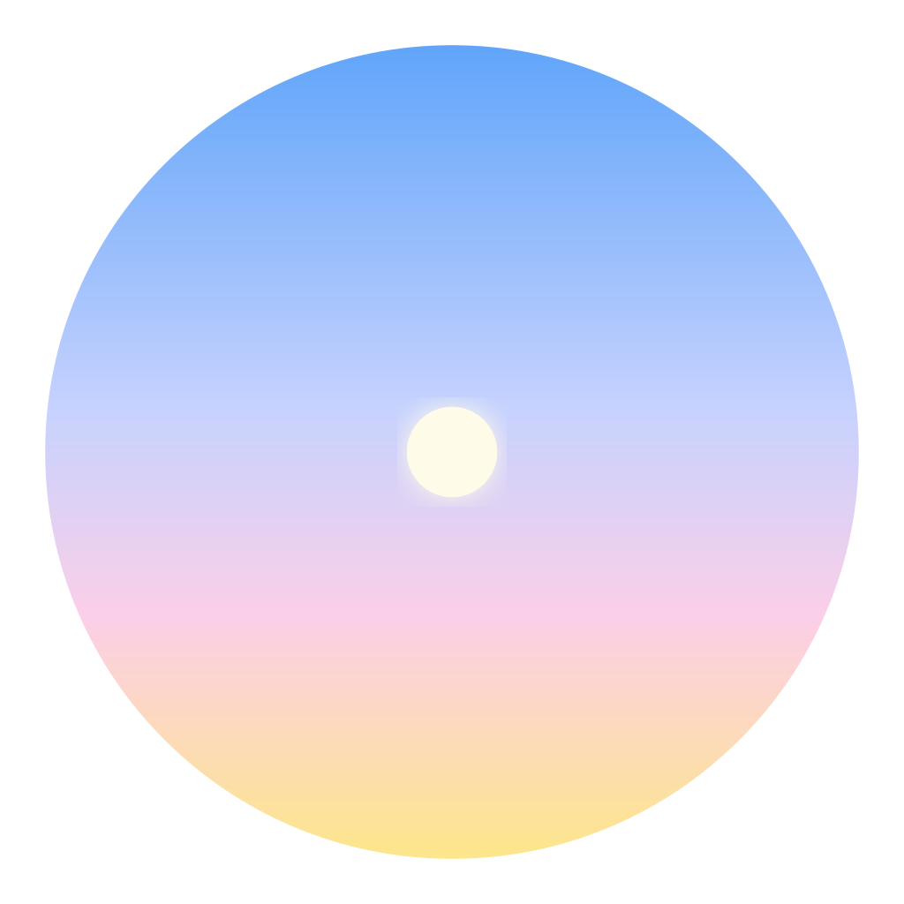

<div align="center">



# Aura

**Feel your atmosphere, instantly.**

*A digital sanctuary for long-distance couples*

[](https://github.com/your-username/aura/releases)
[](https://expo.dev/)
[](https://reactnative.dev/)
[](https://www.typescriptlang.org/)
[](./LICENSE.txt)

</div>

---

## 📖 Table of Contents

- [About Aura](#about-aura)
- [The Story](#the-story-of-aura)
- [Features](#-features)
- [Visual Showcase](#-visual-showcase)
- [Quick Start](#-quick-start)
- [Technology Stack](#-technology-stack)
- [Project Structure](#-project-structure)
- [API Integration](#-api-integration)
- [Deployment](#-deployment)
- [Contributing](#-contributing)
- [License](#-license)

---

## About Aura

Aura is a **digital sanctuary for long-distance couples**, designed to bridge the gap by creating a shared, tangible atmosphere. It translates the real-time local weather and time of two separate individuals into a single, beautifully blended visual experience, allowing you to feel your partner's environment as if it were your own.

<div align="center">

### 🌍 ✦ 🌏

**Transform distance into connection**

From Taipei to Toronto. From Tokyo to New York. From Paris to Perth.
*One shared sky. One living heartbeat. One atmosphere.*

</div>

---

## The Story of Aura

In a world more connected than ever, physical distance remains a profound challenge, especially for those in long-distance relationships. The daily nuances of life—the warmth of the morning sun, the chill of a rainy evening, the quiet of late night—are lost in translation. We text "good morning" when our partner is winding down for bed; we talk about a heatwave while they're wrapping up in a sweater. This disconnect from a shared environment is the subtle, constant reminder of the miles apart.

**Aura was born from this challenge.**

The name "Aura" was chosen to represent the unique, intangible atmosphere that surrounds a person and their location. Our core idea is to capture this local aura and share it. We asked: *What if you could not just be told about your partner's weather, but actually feel it? What if their time of day was more than just a number, but a color, a light, a mood?*

Our mission is to transform the two most fundamental environmental factors, **time and weather**, into a perceptible *Digital Aura*. When you open the app, you're not just viewing data; you are stepping into a shared sky, a blended horizon where your world and theirs meet. It's a quiet, constant connection—a shared breath across the distance.

## ✨ Features

### Core Experience
*   **Blended Sky:** A dynamic, full-screen background that seamlessly merges the weather conditions and time of day from both locations. Your sky and your partner's sky become one.
*   **Real-time Atmosphere:** Fetches and displays current weather (temperature, conditions like sun, clouds, rain) and local time for both users.
*   **Celestial Tracking:** A beautiful, animated sun and moon arc across each user's half of the sky, accurately tracking their position from sunrise to sunset and beyond.
*   **Time Bridge:** A detailed overlay that visualizes and compares the 24-hour daily timelines for both individuals, highlighting sunrise, sunset, and current times.
*   **Connection Data:** Subtly displays the physical distance and time zone difference, grounding the digital connection in real-world context.
*   **Elegant & Minimalist UI:** A focus on a beautiful, immersive experience rather than cluttered social features.

### New in v2.5.0 (Enhanced Personalization & UX)

#### Personalization System
*   **Couple Setup Flow:** First-time users now create a personalized profile:
    *   Choose names and emoji avatars for both partners
    *   Set relationship milestones (relationship start date, next meeting, last met)
    *   Personalized greeting: "Welcome, {Name} & {Name}!"
*   **Status Messages:** Add custom status messages to each location globe (e.g., "Working late tonight", "Miss you ❤️")
    *   Tap the edit icon on any globe to update your status
    *   See your partner's status in real-time
*   **Relationship Timeline:** Visual countdown/counter displaying:
    *   Days together since relationship started
    *   Days until next meeting (with encouraging messages)
    *   Days since you last met
*   **Weather Reminders:** Smart contextual cards based on partner's weather:
    *   "Your partner might need an umbrella today ☔"
    *   "It's freezing where {Name} is! 🥶"
    *   Temperature difference alerts when conditions vary significantly
*   **Message Center:** Leave persistent messages with emoji decorations for your partner to discover

#### Connection Widget Redesign
*   **Compact Heart Button:** Completely redesigned from horizontal card to elegant 64×64 circular button
    *   Moved to bottom-right corner for better visibility
    *   Features breathing heart icon animation (#ec4899 pink)
    *   No longer blocks location displays at the top
    *   One-tap access to "Your Connection" settings

#### Daily Rhythm Editor Overhaul
*   **Dual Timeline View:** Side-by-side schedule comparison for both partners
    *   Removed redundant person selection tabs
    *   See both schedules simultaneously for easy comparison
*   **Custom Time Editing:** Tap any time field to set exact hours (0-23)
    *   Edit sleep schedules, work hours, or school times
    *   No longer limited to preset templates
*   **Visual Overlap Detection:** Three-row timeline showing:
    1. Your activity timeline (cyan markers)
    2. Partner's activity timeline (pink markers)
    3. **Overlapping free time** (green highlighting)
*   **💚 Best Times for Video Calls & Chatting:** Automatically identifies and displays shared free time windows
    *   Shows exact time ranges when both are available
    *   Duration display for each overlap period
    *   Helpful when no overlaps exist with adjustment suggestions

#### Design Philosophy
Version 2.5.0 **transforms Aura from a weather tool to an emotional connection platform**. Every feature is designed to deepen intimacy and create meaningful touchpoints throughout the day.

---

## 🎨 Visual Showcase

<div align="center">

### Core Experience Flow



### Key Features at a Glance

<table>
<tr>
<td align="center" width="33%">
<br/>

<h3>🌈 Blended Sky</h3>
<p><i>Your worlds merge into one shared atmosphere with real-time weather and celestial tracking</i></p>
</td>
<td align="center" width="33%">
<br/>

<h3>💫 Living Heartline</h3>
<p><i>Breathing connection with bidirectional energy flow across any distance</i></p>
</td>
<td align="center" width="33%">
<br/>

<h3>💑 Deep Personalization</h3>
<p><i>Couple profiles, milestones, status messages, and shared schedules</i></p>
</td>
</tr>
</table>

### The Aura Logo: A Visual Metaphor

<div align="center">

</div>

The Aura logo embodies our core philosophy:

- **🌅 Gradient Sphere**: The journey from Night (separation) to Dawn (connection)
  - Yellow (#FDE68A) → Pink (#FBCFE8) → Purple (#C7D2FE) → Blue (#60A5FA)
- **☀️ Glowing Center**: The warmth of human connection
- **🔄 Orbital Rings**: The continuous cycle of time across time zones
- **✨ Breathing Glow**: The shared breath across the distance

Every color, every animation, every design choice tells the story of **two worlds becoming one**.

</div>

---

### New in v2.4.0 (Bridging Worlds)

#### Dynamic Weather Effects
*   **Living Weather Animations:** The background now responds to real-time weather conditions with immersive animations:
    *   **Rain**: Realistic raindrop animations with adjustable intensity (light, moderate, heavy)
    *   **Snow**: Gentle snowflakes with rotation and horizontal drift
    *   **Clouds**: Soft, drifting cloud formations using blur effects
    *   **Thunderstorm**: Dramatic lightning flashes with jagged bolts
*   All effects are mobile-optimized for 60fps performance and don't interfere with the main UI

#### Living Heartline Connection
*   **Breathing Animation:** The connection line now pulses with a gentle, continuous breathing rhythm (4-second cycle), symbolizing "shared breath across the distance"
*   **Bidirectional Particle Flow:** Energy particles travel along the curve in both directions, representing the active exchange between two people
    *   Particles are color-coded based on day/night status
    *   Particle count dynamically adjusts based on your distance (closer = fewer particles, farther = more)
*   The Heartline transforms from a static indicator into a "living" representation of your emotional connection

#### Narrative-Driven Onboarding
*   **Redesigned Intro Screen (8-second journey):**
    1. **Separation:** Two glowing globes appear from opposite sides (you and your partner)
    2. **Hope:** The Aura logo emerges in the center as a bridge between worlds
    3. **Connection:** Energy lines gracefully draw from the globes to the logo
    4. **Unity:** The Heartline forms, previewing the main experience
    *   Accompanied by poetic narrative text: "Two people. Different skies. One shared atmosphere."

*   **Enhanced Connection Animation (10-second transition):**
    1. Globes pulse in and breathe together
    2. World map emerges showing actual geographic locations
    3. City names appear with your actual locations ("{City} ✦ {City}")
    4. Heartline draws between the cities and begins breathing
    5. Smooth transition to the main blended sky experience
    *   Uses precise Mercator projection for geographic accuracy

#### Design Philosophy
All new features follow Aura's core narrative: **"From Separation to Unity"**. Every animation, every particle, every breathing pulse tells the story of two distant worlds coming together through technology and emotion.

## 🏗️ Project Structure

This is a monorepo containing multiple platforms:

```
Aura-Your-Ambiance-Share-APP/
├── apps/
│   ├── web/           # React + Vite web application
│   └── mobile/        # React Native (Expo) mobile app for iOS/Android
├── packages/
│   └── shared/        # Shared business logic, types, and utilities
└── package.json       # Root workspace configuration
```

## 🛠️ Technology Stack

### Web App
*   **Frontend:** React 19, TypeScript, Vite, Tailwind CSS
*   **Icons:** Lucide React

### Mobile App
*   **Framework:** React Native with Expo SDK 54
*   **State Management:** Zustand with AsyncStorage persistence
*   **UI:** React Native StyleSheet, LinearGradient, Reanimated
*   **Icons:** Lucide React Native

### Shared Package
*   **Language:** TypeScript
*   **Contains:** Business logic, type definitions, API services, utility functions

### APIs (Both Platforms)
*   **OpenStreetMap Nominatim API:** Free geolocation lookup (city name to coordinates and vice-versa). No API key required.
*   **Open-Meteo API:** Comprehensive and free weather data.

---

## 🚀 Quick Start

<div align="center">

### 3 Steps to Experience Aura

</div>

<table>
<tr>
<td width="33%" align="center">

### 📥 1. Clone & Install

```bash
git clone https://github.com/your-username/aura.git
cd Aura-Your-Ambiance-Share-APP
npm install
```

<sub>All workspaces configured automatically</sub>

</td>
<td width="33%" align="center">

### 📱 2. Choose Platform

**Mobile** (Recommended)
```bash
npm run mobile
```
<sub>Press `i` for iOS, `a` for Android</sub>

**Web**
```bash
npm run web
```
<sub>Opens at localhost:5173</sub>

</td>
<td width="33%" align="center">

### 🌍 3. Set Your Locations

1. Enter your city
2. Enter partner's city
3. Watch worlds collide ✨

<sub>No API keys needed!</sub>

</td>
</tr>
</table>

---

### 💻 Detailed Setup Instructions

<details>
<summary><b>📋 Prerequisites</b></summary>

- **Node.js** v18 or later ([Download](https://nodejs.org/))
- **npm** v9 or later (comes with Node.js)
- **Expo Go** app on your phone for mobile testing ([iOS](https://apps.apple.com/app/expo-go/id982107779) | [Android](https://play.google.com/store/apps/details?id=host.exp.exponent))

**Optional for native builds:**
- Xcode (for iOS builds on macOS)
- Android Studio (for Android builds)

</details>

<details>
<summary><b>📱 Running Mobile App</b></summary>

```bash
# Standard start
npm run mobile

# With clean cache (recommended after installing packages)
npm run mobile -- --clear

# Type checking
npm run type-check
```

**In the Metro Bundler terminal:**
- Press **`i`** → Open iOS simulator
- Press **`a`** → Open Android emulator
- **Scan QR code** → Test on your physical device via Expo Go

**Troubleshooting:**
- If animations don't play: `npm run mobile -- --clear`
- If you see type errors: `cd apps/mobile && npx expo-doctor`

</details>

<details>
<summary><b>🌐 Running Web App</b></summary>

```bash
# Start development server
npm run web

# Build for production
npm run build:web
```

The app will be available at **http://localhost:5173**

</details>

<details>
<summary><b>🔧 Available Commands</b></summary>

| Command | Description |
|---------|-------------|
| `npm run mobile` | Start mobile development server |
| `npm run web` | Start web development server |
| `npm run type-check` | Type check all workspaces |
| `npm run generate-icons` | Regenerate app icons from SVG |
| `npm run clean` | Clean all node_modules and caches |

</details>

---

## 🌐 API Integration

<div align="center">

### Zero Configuration Required ✨

**Both APIs are completely free, no keys needed**

</div>

```mermaid
graph TB
    subgraph User Input
        A[City Name<br/>"Tokyo"]
    end

    subgraph Geocoding
        B[OpenStreetMap<br/>Nominatim API]
        B -->|Lat/Lon| C[35.6762, 139.6503]
    end

    subgraph Weather Data
        D[Open-Meteo<br/>Weather API]
        C -->|Coordinates| D
        D -->|Weather Data| E[Temperature<br/>Conditions<br/>Sunrise/Sunset<br/>Timezone]
    end

    subgraph Aura Display
        E --> F[Blended Sky<br/>Visualization]
    end

    A --> B

    style B fill:#22c55e,stroke:#16a34a,color:#fff
    style D fill:#3b82f6,stroke:#2563eb,color:#fff
    style F fill:#ec4899,stroke:#db2777,color:#fff
```

<details>
<summary><b>🗺️ OpenStreetMap Nominatim API</b></summary>

**Purpose:** Convert city names to coordinates (geocoding) and vice versa (reverse geocoding)

**Features Used:**
- ✅ Search API: "Tokyo" → `{lat: 35.6762, lon: 139.6503, name: "Tokyo"}`
- ✅ Reverse Geocoding: Coordinates → City name
- ✅ Automatic rate limiting (1 request/second)
- ✅ Fuzzy matching for city names

**Configuration:**
```typescript
// No API key needed!
const response = await fetch(
  `https://nominatim.openstreetmap.org/search?` +
  `city=${cityName}&format=json`,
  { headers: { 'User-Agent': 'Aura-App/2.5.0' } }
);
```

**Important Notes:**
- 🆓 Completely free, no registration
- ⏱️ Rate limited to 1 req/sec (auto-handled)
- 📝 Attribution required (included in app)

</details>

<details>
<summary><b>☁️ Open-Meteo Weather API</b></summary>

**Purpose:** Fetch real-time weather, forecasts, and timezone data

**Features Used:**
- ✅ Current weather: temperature, conditions, day/night status
- ✅ Daily data: sunrise, sunset times
- ✅ IANA timezone: accurate local time
- ✅ Weather codes: mapped to beautiful icons and animations

**Example Response:**
```json
{
  "current": {
    "temperature_2m": 22.5,
    "is_day": 1,
    "weather_code": 3
  },
  "daily": {
    "sunrise": ["2025-01-15T06:42"],
    "sunset": ["2025-01-15T16:55"]
  },
  "timezone": "Asia/Tokyo"
}
```

**Weather Code Mapping:**
- `0-3`: Clear/Partly cloudy → Particle effects
- `51-67`: Rain → Realistic raindrop animations
- `71-77`: Snow → Gentle snowfall
- `95-99`: Thunderstorm → Lightning effects

**Potential Expansions:**
- Hourly forecasts for detailed timelines
- Air quality, UV index, precipitation probability

</details>

---

## ☁️ Deployment

<div align="center">

### Ready to Share Aura with the World? 🚀

</div>

<table>
<tr>
<td width="50%">

### 🌐 Web App

**Static deployment** - works on any hosting platform

```bash
# Build optimized static files
npm run build:web
```

**Deploy to:**
- ▲ [Vercel](https://vercel.com/) - Recommended
- 🌿 [Netlify](https://www.netlify.com/)
- 📄 [GitHub Pages](https://pages.github.com/)
- 🔥 [Firebase Hosting](https://firebase.google.com/docs/hosting)

**Build output:** `apps/web/dist/`

</td>
<td width="50%">

### 📱 Mobile App

**Native builds** via Expo Application Services (EAS)

```bash
# iOS (requires macOS + Xcode)
cd apps/mobile
npx eas build --platform ios

# Android
cd apps/mobile
npx eas build --platform android
```

**Submit to stores:**
```bash
# iOS App Store
npx eas submit --platform ios

# Google Play Store
npx eas submit --platform android
```

</td>
</tr>
</table>

<div align="center">

### 🎉 No Environment Variables Required!

All APIs are public and free - just build and deploy!

</div>

---

## 🤝 Contributing

<div align="center">

**We welcome contributions from developers, designers, and dreamers!**

Aura is built with ❤️ by people who believe in the power of connection.

</div>

### Ways to Contribute

<table>
<tr>
<td width="33%" align="center">

### 🐛 Report Bugs

Found an issue?
[Open a bug report](https://github.com/your-username/aura/issues/new?labels=bug)

</td>
<td width="33%" align="center">

### 💡 Suggest Features

Have an idea?
[Submit an enhancement](https://github.com/your-username/aura/issues/new?labels=enhancement)

</td>
<td width="33%" align="center">

### 🔧 Submit Code

Ready to contribute?
[Read the guidelines](./CONTRIBUTING.md)

</td>
</tr>
</table>

### Development Workflow

```bash
# 1. Fork and clone
git clone https://github.com/your-username/aura.git

# 2. Create feature branch
git checkout -b feature/amazing-feature

# 3. Make your changes
npm run type-check  # Ensure types are correct
npm run mobile      # Test on mobile

# 4. Commit with meaningful message
git commit -m "Add amazing feature that improves X"

# 5. Push and create PR
git push origin feature/amazing-feature
```

### Areas We'd Love Help With

- 🎨 **Design**: UI/UX improvements, animations, visual effects
- 📱 **Features**: Weather reminders, shared calendars, photo sharing
- 🌍 **Internationalization**: Translations for different languages
- 📝 **Documentation**: Tutorials, guides, API documentation
- 🧪 **Testing**: Unit tests, integration tests, E2E tests
- ♿ **Accessibility**: Screen reader support, color contrast improvements

---

## 📜 License

<div align="center">

**MIT License** - Free to use, modify, and distribute

See [LICENSE.txt](./LICENSE.txt) for full details

</div>

---

## 🙏 Acknowledgments

<div align="center">

**Built with these amazing open-source projects:**

</div>

- 🌍 [OpenStreetMap](https://www.openstreetmap.org/) & [Nominatim](https://nominatim.org/) - Geocoding services
- ☁️ [Open-Meteo](https://open-meteo.com/) - Weather data API
- ⚛️ [React](https://react.dev/) & [React Native](https://reactnative.dev/) - UI frameworks
- 📱 [Expo](https://expo.dev/) - Mobile development platform
- 🎨 [Reanimated](https://docs.swmansion.com/react-native-reanimated/) - Smooth animations
- 💾 [Zustand](https://zustand-demo.pmnd.rs/) - State management

---

<div align="center">

## 💝 Made with Love


### Connecting Hearts Across the Distance

*From the first "hello" across continents*
*To the longing "goodnight" in different time zones*
*Aura keeps your love alive in every sunrise, every rainfall, every shared moment*

**Built for everyone who's ever looked at the sky and thought of someone far away.**

---

### 🌟 If Aura helps you feel closer, give it a star! 🌟

[](https://github.com/your-username/aura)

---

*Questions? Feedback? Found a bug?*
**Open an [issue](https://github.com/your-username/aura/issues) or reach out!**

Made with ❤️ and ☕ by developers in long-distance relationships

</div>
